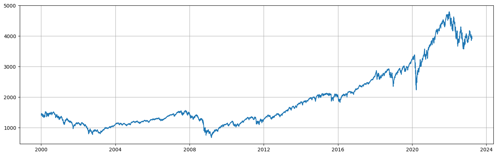
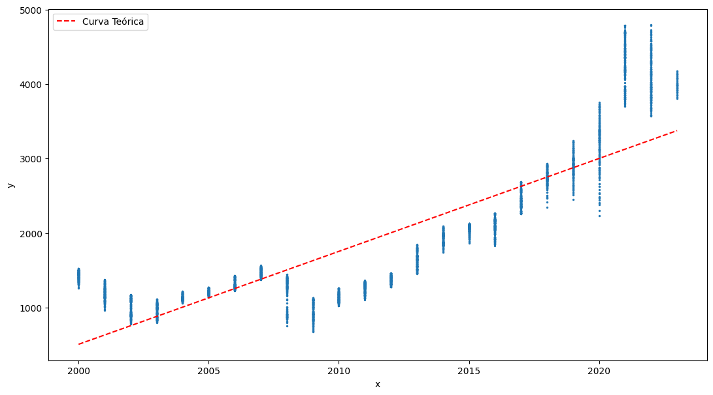
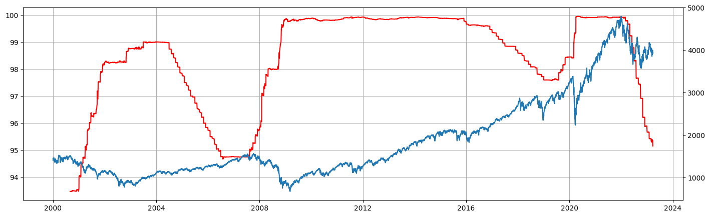
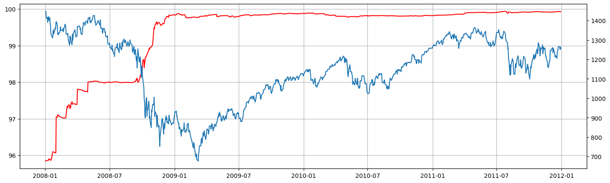
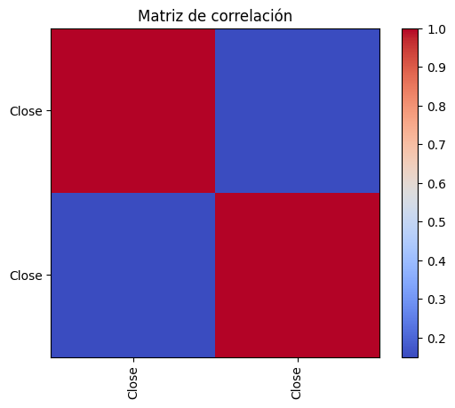
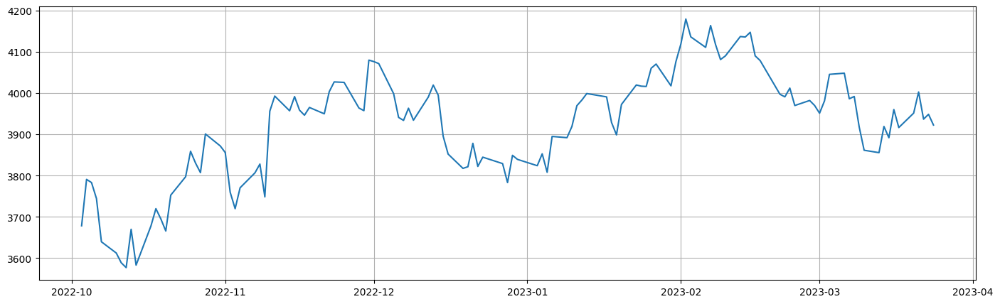

# Invertir en el indice S&P500
El índice S&P 500 es un índice bursátil ponderado por capitalización de mercado que incluye las 500 mayores empresas estadounidenses que cotizan en la Bolsa de Nueva York.

* S&P 500
El comportamiento del índice S&P 500 es seguido de cerca por inversores y analistas financieros, ya que es considerado un barómetro de la economía estadounidense. El índice refleja la salud de las empresas más grandes y exitosas del país y, por lo tanto, su desempeño es visto como un indicador de la dirección futura del mercado de valores en general. A lo largo del tiempo, el S&P 500 ha demostrado ser un buen indicador de la economía estadounidense en su conjunto, con movimientos en el índice que reflejan con frecuencia los cambios en los indicadores económicos clave, como el PIB.

__Comportamiento Historico del S&P 500__

Observando detalladamente la graficas podemos notar que el valor de este indice la mayor parte del tiempo se encuentra en una cotizacion acendente delos precios a largo plazo esto lo pedemos verificar si hacemos una regresion lineal a lo largo de estos ultimos 23 años.

* Futuros de fondos
Los futuros de fondos federales son contratos negociados en los mercados de futuros que permiten a los inversores apostar sobre la dirección futura de la tasa de interés a corto plazo que los bancos comerciales cobran entre sí por préstamos de un día para otro, conocida como la tasa de fondos federales. Estos contratos permiten a los inversores especular sobre si la tasa de interés aumentará o disminuirá en el futuro, y también les permiten protegerse contra el riesgo de fluctuaciones en las tasas de interés. Los futuros de fondos federales son una herramienta comúnmente utilizada por los bancos, las empresas y otros inversores institucionales para administrar el riesgo de las tasas de interés y para tomar posiciones en el mercado de futuros.

* Crisis 2008
En Momentos financieros dificiles el indice (S&P 500) al igual que el resto de la economia sufre un retroceso en el valor de mercado, pero en consecuencia como podemos observar en la grafica al ocurrir esta devaluacion de mercado tambien reaccionan los futuros de fondos federales dando como resultado una correlacion negativa entre el valor del indice y los futuros federales.

* Matriz de correlacion
Una correlacion negativa entre 2 variables nos indica que a medida que un valor aumenta el otro disminuye y de forma contraria.

El Comportamiento de este Indice, el cual contiene las empresas mas valoradas de la economia estadounidence nos muestra que en cuarquier momento de la historia que se haya invertido en este indice el dia de hoy habria beneficios incluso si esta inversion ubiera sido en plana cuarentena e incluso antes de esta como se puede evidenciar en la siguiente grafica.

Tambien veamos los ultimos 6 meses.

Por ultimo quiero concluir que lo expuesto anteriormente debe tomarse con mucha precaucion y teniendo en cuenta que es implosible predecir una crisis financiera por lo tanto recomiendo que al momento de invertir en un indice como el S&P 500 se realizo a largo o mediano plazo es decir de 3 años en adelante, por ultimo dejo el porcentaje de crecimientos de este indice desde los ultimos 23 años.

crecimiento global desde 2000-01-03 00:00:00 ->62.90268755033478%
crecimiento desde 2018 ->31.276844695663648%
crecimiento desde 2020 ->16.948993677889792%
crecimiento desde 2022-10-03 ->6.227328345185475%